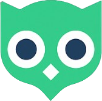
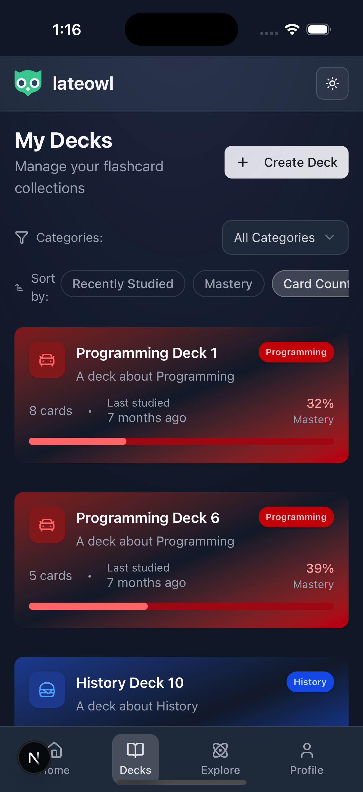
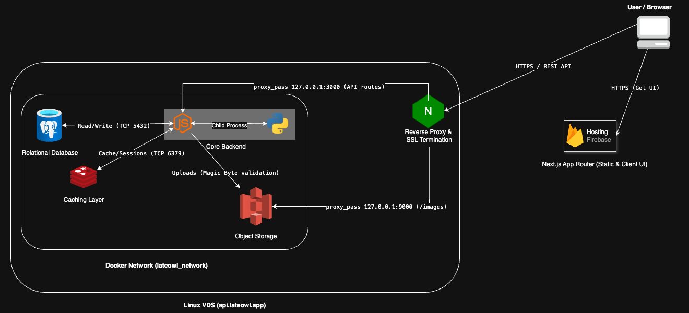

#  LateOwl — High-Performance Spaced Repetition Platform

[](https://lateowl.app)
[](https://github.com/artsiom-andrasovich/frontend-cotton)
[](https://github.com/artsiom-andrasovich/backend-cotton)

LateOwl is a full-stack learning platform designed to optimize memorization using the FSRS (Free Spaced Repetition Scheduler) algorithm. It features a decoupled, cloud-native architecture with a robust API, secure custom authentication, and scalable media storage.

> 🌐 **Try it out:** [lateowl.app](https://lateowl.app) > _(Test credentials: `test@lateowl.app` / `TestPassword123!`)_

<div align="center">
  <br/>
  
  <br/><br/>
</div>

---

## 🏗️ System Architecture



The platform utilizes a microservices-oriented approach, dividing concerns between the client interface, the core API, and isolated data storage layers:

- **Client Application:** Next.js (App Router) deployed serverless on Firebase Hosting.
- **Core API:** NestJS running within an isolated Docker network on a Linux VDS.
- **Algorithm Engine:** Python child processes spawned natively by Node.js to execute custom ML card-weighting algorithms.
- **Storage Layer:** PostgreSQL (relational data), Redis (caching), and MinIO (S3-compatible object storage for media).
- **Reverse Proxy:** Nginx configured for SSL termination and secure internal routing.

## 🚀 Key Technical Features

- **Machine Learning Integration:** FSRS algorithm integration to calculate optimal review intervals.
- **Robust Security:** Custom JWT-based authentication flow with HTTP-only refresh tokens, exponential backoff for incorrect logins, and Magic Byte validation for media uploads.
- **Optimized Data Layer:** PostgreSQL database with cursor-based pagination for handling large datasets efficiently, supplemented by Redis.
- **Modern Editor:** Custom rich-text editing experience using TipTap, with KaTeX for mathematical formula rendering and Lowlight for syntax highlighting.

## 🛠️ Tech Stack

| Category           | Technologies                                                            |
| ------------------ | ----------------------------------------------------------------------- |
| **Frontend**       | Next.js 16 (App Router), React 19, Tailwind CSS, React Query, Shadcn UI |
| **Backend**        | NestJS, TypeScript, Node.js, Python                                     |
| **Database & ORM** | PostgreSQL, Prisma ORM, Redis                                           |
| **DevOps & Cloud** | Docker, Docker Compose, Nginx, Linux, AWS S3 (MinIO), Firebase          |
| **Tooling**        | Git, RESTful APIs, JWT, Zod, Nodemailer                                 |

---

## ⚙️ Local Development Setup

The project is split into two repositories. This repository contains the Core API and the Dockerized infrastructure.

### 1. Start the Infrastructure (Database, Redis, MinIO)

Navigate to the infrastructure folder and spin up the containers:

```bash
cd infrastructure
cp .env.example .env  # Fill in your local variables
docker-compose up -d
```

### 2. Start the Backend API (NestJS)

Return to the root directory, install dependencies, and start the development server:

```bash
cd ..
yarn
yarn start:dev
```

The API will be available at http://localhost:3000.

### 3. Start the Frontend (Next.js)

Clone the frontend repository in a separate folder alongside your backend:

```bash
git clone https://github.com/artsiom-andrasovich/frontend-cotton
cd frontend-cotton
yarn
yarn dev
```

The Client App will be available at http://localhost:3001.
